# Tutorial for my Quest-System plugin.

## Introduction
This plugin is a simple quest system. It allows you to create quests with different objectives and rewards. The plugin is highly customizable and easy to use. You can create quests for players to complete and reward them with items or experience points.

## Features
- Create and manage quests with different objectives and rewards in-game.
- Reward players with items or experience points
- Highly customizable
- Run multiple Quests at once
- Quests where you have to run somewhere have a nice indicator for the players.
- You can use either the npc (Villager) or the command /quest to open the quest menu.
- Admins can manage the quests with the command /qa m or /quest manage
- If a quest is in progress the player can see is progress at the boss bar
- Sign can be places which show all players their individual quests. Including time and progress
- One database for all servers
- If you join the server, and you have a quest in progress you will get a message which will redirect you to the quest menu.

## How to use
1. Clone the entire repository somewhere on your computer. The repository already contains 2 lobby servers where the plugin is deployed.
2. Execute the start-all-servers.bat file to start the lobby servers and bungeecord.
3. Connect to the bungeecord server with the IP `localhost:25565`.
4. You can now join the lobby servers and test the plugin.

## What to expect

### First time joining
Either right-click the npc or use the command /q to open the quest menu.
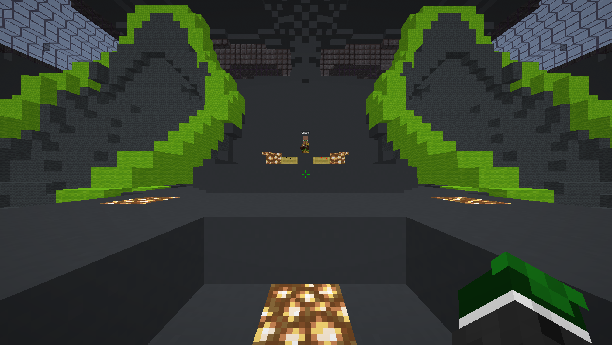

### Quest menu
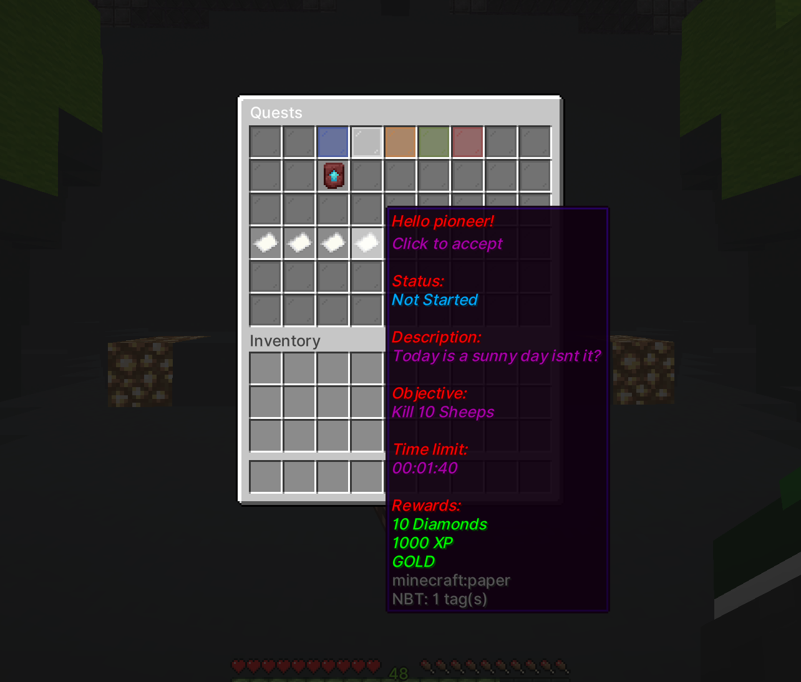

### Quest progress
In this image you can see
- The progress of the quest in the boss bar
- Chat messages which tell the player what to do
- The signs show once how many Quests a player has in progress and on the other sign the time and progress of the quest
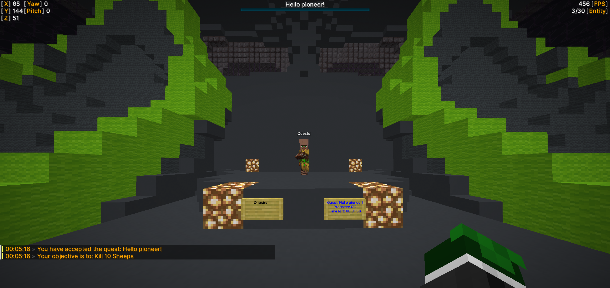

### Quest multiple quests in progress
If there is more than one quest in progress the player can see the progress of all quests in each boss bar

The sign changes and the player can right-click the sign to switch between the quests
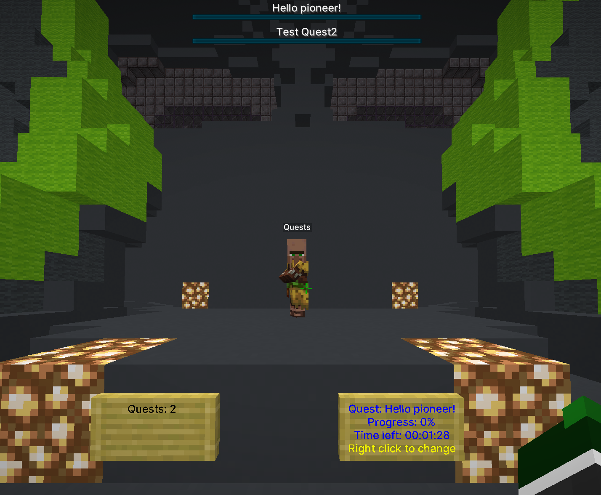

### MOVE Quests
If a quest requires the player to move somewhere the player will see a nice indicator
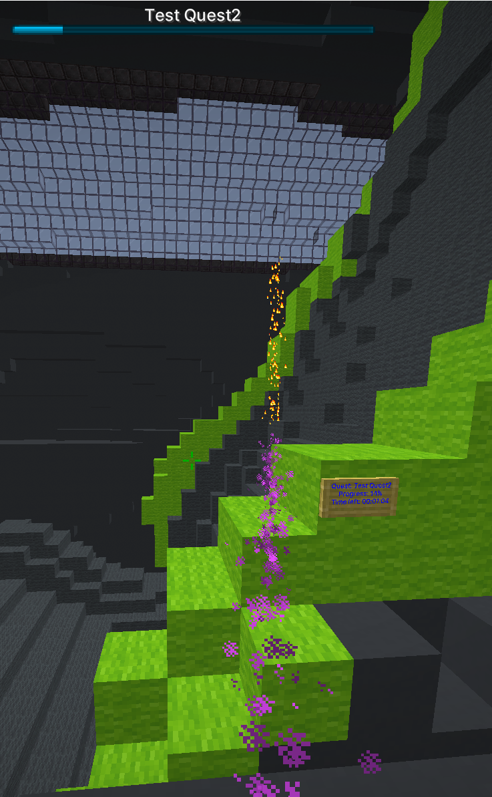

### Quest completed
Once the player has completed the quest he will get a message/alert and the reward/rewards
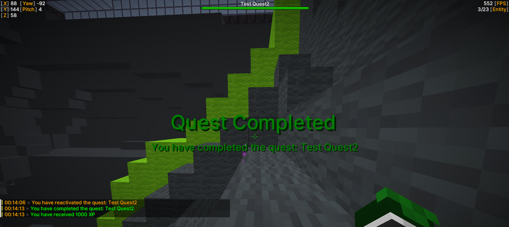

### Quest cancelled
- If the time runs out the quest is automatically canceled and the player he will get a message/alert
- The player cancels the quest manually in the quest menu by clicking on the quest
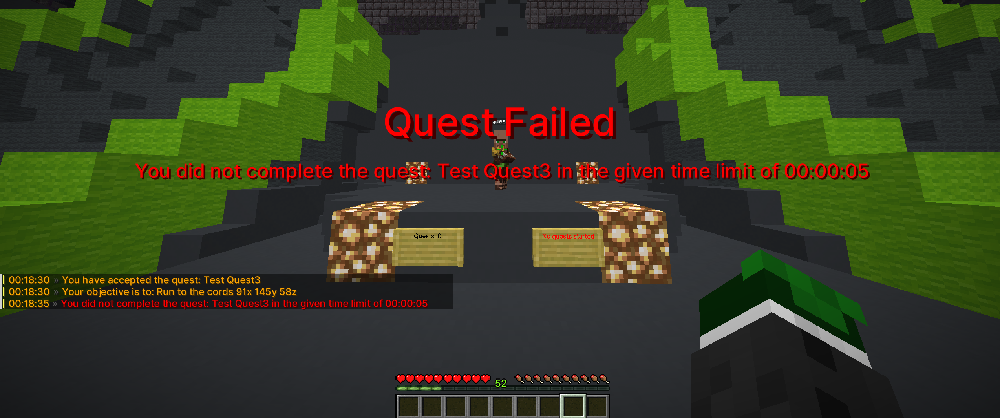

### Admin commands
- Admins can manage the quests with the command /qa m or /quest manage
- Admins can create, delete, edit, and list all quests
- Admins can also edit all the rewards and objectives using the same command
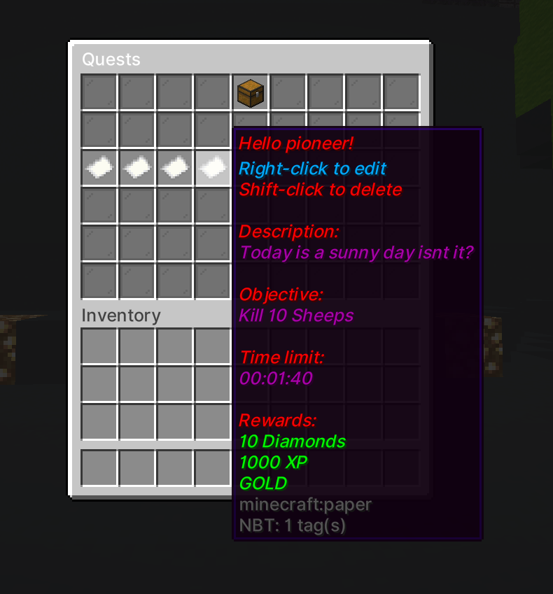
- If the admin deletes the quest using Shift-click the UI is updated directly
- If the admin decides to edit the quest using Right-click a new inventory opens
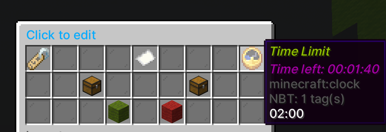
- If the admin clicks on the item an anvil UI opens where the admin can edit the text
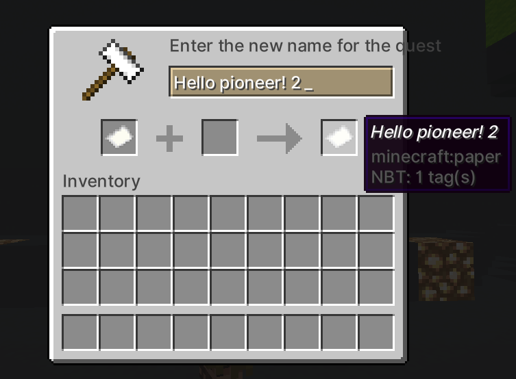
- If the admin clicks either on the objective or the reward a completely different inventory opens, where the admin has an overview over all rewards or objectives
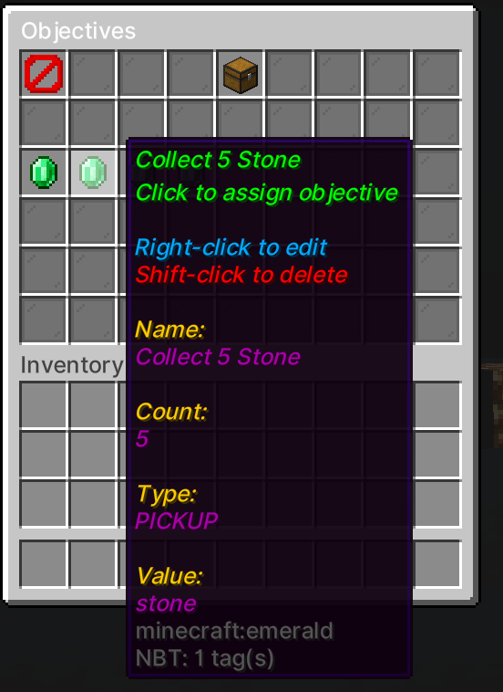
- Here the admin can also edit or create a new objective, or he decides to switch the objective by just clicking on one of the items
- The same applies to the rewards, with the difference that a quest can have multiple rewards but only one objective.
- The create menu is the same as the edit menu, but the admin can create a new objective or reward with it.

## Project structure
The project has the following structure:

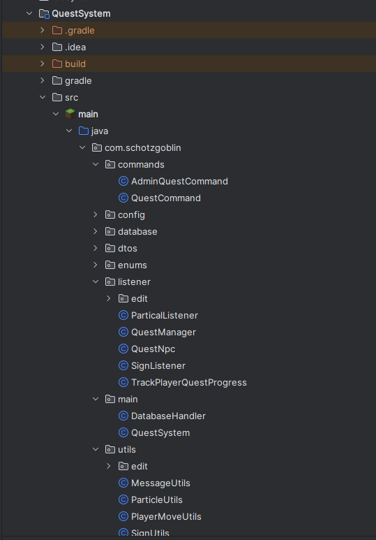

- The `QuestSystem` class located in the main module contains the fundamental code of the Java Plugin.
- In the same module is the `DatabaseHandler`, which has all the async db operations in it.
- The database is a SQLite database, which is located in the `database` folder.
- Here is an ERD of the database:
- 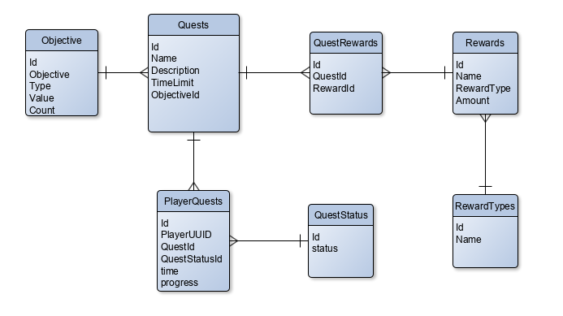
- The remaining part is self-explanatory
- The listener package contains all the listeners including the management of the inventory clicks of the admin commands
- The command package contains all the commands including the admin command and the quest command
- The utils package contains all the utility and management classes either needed for the management of the edit command or other utilities like converting a String to a Location...

## Unsolved problems and blemishes
- The plugin does not have checks on everything. Meaning that if the Admin decides to input an invalid Type for the reward, the reward just won't work.
- Unit tests are only written for some methods in the Utils class due to time issues.
- If a method needs a lot of information from the config, a huge block of code is needed to get all those texts and colours.
- The type of the objectives is not in a separate table due to time issues and overlooking at first.

## Conclusion
I had a lot of fun developing this plugin as an application-task.
I would appreciate if the team would consider that while developing this plugin I had to learn for my Oral Matura which was on the 19.06.2024 (I still achieved an average of 1.2 on the Matura).

Either way a lot of time went into this plugin and I hope you like the finished product <3.

If you have any questions or suggestions feel free to contact me (I am not reachable from 22.06-28-06 due to the Matura trip).